# Network Packet Sniffer & Security Monitor

> **Course End Project (CEP) — Computer Networks and Security (CNS)**  
> A lightweight, modular Python-based network packet sniffer, signature detector engine, persistent alert logger, and real-time web monitoring dashboard.

---

## Table of Contents
- [1. Project Title and Overview](#1-project-title-and-overview)
- [2. Key Features](#2-key-features)
- [3. Technology Stack](#3-technology-stack)
- [4. System Architecture](#4-system-architecture)
- [5. Packet Capture and Parsing](#5-packet-capture-and-parsing)
- [6. Detection Engine](#6-detection-engine)
  - [6.1 TCP SYN Scan Detector](#61-tcp-syn-scan-detector)
  - [6.2 TCP SYN Flood Detector](#62-tcp-syn-flood-detector)
  - [6.3 UDP Scan Detector](#63-udp-scan-detector)
  - [6.4 ICMP Host Sweep Detector](#64-icmp-host-sweep-detector)
- [7. Alert Management and Persistence](#7-alert-management-and-persistence)
- [8. Statistics and Capture State](#8-statistics-and-capture-state)
- [9. Web Dashboard](#9-web-dashboard)
- [10. HTTP API Reference](#10-http-api-reference)
  - [10.1 GET /](#101-get-)
  - [10.2 GET /capture_status](#102-get-capture_status)
  - [10.3 GET /packets](#103-get-packets)
  - [10.4 GET /alerts](#104-get-alerts)
  - [10.5 GET /statistics](#105-get-statistics)
- [11. Prerequisites](#11-prerequisites)
- [12. Installation](#12-installation)
- [13. Running the Application](#13-running-the-application)
- [14. Testing](#14-testing)
- [15. Project Directory Structure](#15-project-directory-structure)
- [16. Security, Privacy, and Responsible Use](#16-security-privacy-and-responsible-use)
- [17. Limitations](#17-limitations)
- [18. Future Improvements](#18-future-improvements)
- [19. Demonstration Guide](#19-demonstration-guide)
- [20. Troubleshooting](#20-troubleshooting)

---

## 1. Project Title and Overview

### Project Name
**Network Packet Sniffer & Security Monitor**

### Overview & Problem Statement
Modern computer networks face continuous reconnaissance and volume-based attack attempts, ranging from port scans and host sweeps to Denial-of-Service (DoS) floods. Understanding how network traffic flows across OSI layers—and how anomalous patterns manifest in packet headers—is fundamental to network defense.

This project implements a multi-threaded, modular network monitoring tool built in Python. It captures live network frames from active network interfaces using [Scapy](https://scapy.net/), parses network and transport headers (IPv4, IPv6, TCP, UDP, ICMP, ARP), applies rule-based signature detection to identify potential security threats in real-time, logs alerts persistently to disk, and exposes an HTTP REST API and interactive web-based dashboard for network visibility.

### Project Objectives
- **Educational Prototype**: Demonstrate key Computer Networks and Security concepts including frame encapsulation, protocol header fields, sliding time-window analysis, signature detection, and multi-process state synchronization.
- **Real-Time Traffic Inspection**: Capture and decode network traffic without blocking high-speed packet flow.
- **Rule-Based Threat Detection**: Flag suspicious TCP port scans, TCP SYN floods, UDP port scans, and ICMP host sweeps using sliding window analysis.
- **Deduplicated Persistent Logging**: Persist alerts to structured JSON storage while suppressing duplicate notifications.
- **Interactive Monitoring Dashboard**: Provide network administrators with a dark-themed visual dashboard showing real-time system state, packet metrics, security distribution, and live traffic buffers.

### Scope & Positioning
This software is designed as an educational **Network Security Monitor (NSM)** and prototype **Intrusion Detection System (IDS)**. It operates at the host/network boundary for local monitoring. It is not intended as a replacement for enterprise-grade hardware IDSs (e.g., Snort, Suricata, or Zeek), but rather serves as a fully readable, fully tested implementation demonstrating end-to-end packet processing pipeline mechanics.

---

## 2. Key Features

- **Live Multi-Protocol Packet Capture**: Asynchronous live packet sniffing using Scapy's engine.
- **Dual Stack Support**: Seamless disassembly of both IPv4 and IPv6 network layer packets.
- **Multi-Protocol Field Extraction**: Decodes IP addresses, transport protocol types (TCP, UDP, ICMP, ARP), source/destination ports, frame length, and TCP flag strings (`S`, `A`, `PA`, `SA`, etc.).
- **Multi-Vector Detection Engine**:
  - **TCP SYN Scan Detection**: Identifies single-source probes targeting $\ge 5$ unique destination ports on a target host within a 10-second sliding window.
  - **TCP SYN Flood Detection**: Identifies high-frequency bursts of $\ge 20$ SYN packets from a single source IP within a 5-second sliding window.
  - **UDP Scan Detection**: Flags single-source probing of $\ge 5$ unique UDP ports on a target host within a 10-second sliding window.
  - **ICMP Host Sweep Detection**: Flags single-source ping/probe sweeps targeting $\ge 5$ unique destination IP hosts within a 10-second sliding window.
- **Stateful Alert Deduplication**: Prevents alert flooding by suppressing duplicate `(type, source_ip)` alerts. Pre-loads existing alert history at startup to retain deduplication state across server restarts.
- **Atomic Persistent Storage**: Formats and writes alerts atomically into `alerts.json` with formatted indentation.
- **Thread-Safe & Process-Safe Capture State**: Maintains a shared capture state file (`/tmp/packet_sniffer_capture_state.json`) with an atomic write/swap pattern (`.tmp` -> `os.replace`), file permissions (`0o644`), background heartbeat thread (1.5s interval), and automatic stale-capture detection.
- **Bounded Live Packet Stream Buffer**: Maintains a ring-buffer (`deque(maxlen=50)`) of recent packet payloads for real-time dashboard inspection.
- **RESTful HTTP API**: Exposes JSON endpoints (`/capture_status`, `/packets`, `/alerts`, `/statistics`) built entirely on Python's standard library `http.server`.
- **Interactive Web Dashboard**: Single-page monitoring dashboard (`http://localhost:8000`) featuring dark glassmorphic styling, Google Fonts (`Orbitron`, `Inter`, `JetBrains Mono`), auto-refreshing metrics (3s interval), alert type/IP filter inputs, alert pagination, and a live packet stream table.
- **Isolated Unit Testing Suite**: Complete 96-test suite verifying packet parsing, detector logic, alert storage isolation, state thread-safety, and HTTP API endpoints.

---

## 3. Technology Stack

| Technology | Layer / Category | Actual Purpose in Project |
| :--- | :--- | :--- |
| **Python 3.10+** | Core Language | Primary implementation language for capture engine, detectors, storage, and HTTP server. |
| **Scapy 2.8.0** | Packet Capture | Captures raw socket frames and decodes protocol headers (`IP`, `IPv6`, `TCP`, `UDP`, `ICMP`, `ARP`). |
| **BaseHTTPRequestHandler** | Web Server | Standard-library HTTP server (`http.server`) serving JSON API endpoints and the dashboard HTML. |
| **JSON** | Storage & State Format | Used for persistent alert records (`alerts.json`) and shared inter-process capture state (`/tmp/packet_sniffer_capture_state.json`). |
| **Threading & Locking** | Concurrency | `threading.Lock` and daemon threads manage process state synchronization and heartbeat updates. |
| **HTML5 & CSS3** | Frontend UI | Single-page dashboard UI using CSS custom properties, glassmorphism, responsive grid, and custom status dots. |
| **JavaScript (ES6)** | Frontend Logic | Native `fetch` API calls, dynamic DOM manipulation, auto-refresh timer (`setInterval`), filtering, and pagination. |
| **Google Fonts CDN** | Typography | Loads `Orbitron` (headers), `Inter` (UI body), and `JetBrains Mono` (monospaced logs/addresses). |
| **Python unittest** | Quality Assurance | Native testing framework used to implement 96 automated unit and integration tests. |

---

## 4. System Architecture

### Pipeline Data Flow

```mermaid
flowchart TD
    A[Network Interface / Raw Sockets] -->|Live Packet Stream| B[Scapy Sniffer - main.py]
    B -->|Raw Packet Frame| C[Packet Parser - packet_parser.py]
    C -->|Parsed Packet Dict| D[Capture State Manager - capture_state.py]
    C -->|Parsed Packet Dict| E[Detection Engine - detection_engine.py]
    
    E --> F1[SynScanDetector]
    E --> F2[SynFloodDetector]
    E --> F3[UdpScanDetector]
    E --> F4[IcmpSweepDetector]
    
    F1 -->|Security Alert| G[Alert Manager - alert_manager.py]
    F2 -->|Security Alert| G
    F3 -->|Security Alert| G
    F4 -->|Security Alert| G
    
    G -->|If New & Unique| H[Statistics Manager - statistics_manager.py]
    G -->|If New & Unique| I[Storage Manager - storage_manager.py]
    
    I -->|Atomically Writes| J[(alerts.json)]
    D -->|Atomically Writes| K[(/tmp/packet_sniffer_capture_state.json)]
    
    L[HTTP Server - http_server.py] -->|Reads State| D
    L -->|Reads Alerts| I
    L -->|Reads Statistics| H
    
    M[Web Browser / Dashboard] <-->|Polling via HTTP API| L
```



### Component Breakdown & Inter-Process Communication
1. **Packet Capture Process (`main.py`)**: Runs with root/super-user privileges (`sudo`). It initializes `capture_state_manager`, starts a background heartbeat thread (updating timestamp every 1.5s), invokes Scapy's `sniff()` loop, parses frames, passes dictionaries to detectors, deduplicates alerts, prints terminal outputs, and updates state metrics.
2. **HTTP Dashboard Server (`http_server.py`)**: Runs as a standard user process on port 8000. It reads persistent alerts from `alerts.json` and live capture metrics from `/tmp/packet_sniffer_capture_state.json`.
3. **Shared State Mechanism (`capture_state.py`)**: Acts as a process-safe bridge between `main.py` and `http_server.py`. When `main.py` receives a packet, it records packet metadata and increments counters, writing to `/tmp/packet_sniffer_capture_state.json.tmp` and performing an atomic `os.replace`. When `http_server.py` handles a `/capture_status` or `/packets` request, it reads this file to report real-time capture metrics.

---

## 5. Packet Capture and Parsing

### Packet Parsing Architecture (`packet_parser.py`)
Captured raw frames pass into `parse_packet(packet)` which extracts standardized metadata into a unified Python dictionary structure:

```python
{
    "timestamp": 1791534802.583777,
    "ip_version": 4,                    # 4 for IPv4, 6 for IPv6, None otherwise
    "source_ip": "192.168.1.50",       # Source IP or ARP sender IP
    "destination_ip": "192.168.1.10",  # Destination IP or ARP target IP
    "protocol": "TCP",                 # "TCP", "UDP", "ICMP", "ARP", or numeric string
    "source_port": 60087,              # Transport source port (TCP/UDP)
    "destination_port": 443,           # Transport destination port (TCP/UDP)
    "length": 174,                     # Total frame length in bytes
    "tcp_flags": "PA"                  # TCP flags string ("S", "A", "PA", "SA", etc.)
}
```

### Supported Protocol Combinations
- **IPv4 Layer (`IP in packet`)**: Extracts `src`, `dst`, and numeric protocol identifier (`proto`).
- **IPv6 Layer (`IPv6 in packet`)**: Extracts `src`, `dst`, and next header protocol identifier (`nh`).
- **ARP Layer (`ARP in packet`)**: Identifies protocol as `"ARP"`, extracting `psrc` and `pdst`.
- **TCP Layer (`TCP in packet`)**: Identifies protocol as `"TCP"`, extracting `sport`, `dport`, and string representation of flags (`flags`).
- **UDP Layer (`UDP in packet`)**: Identifies protocol as `"UDP"`, extracting `sport` and `dport`.
- **ICMP Layer (`ICMP in packet`)**: Identifies protocol as `"ICMP"`.

### Exception Handling & Non-IP Packets
If a captured frame is non-IP/non-ARP or contains missing protocol headers, unextracted fields default gracefully to `None` without raising uncaught exceptions or interrupting the sniffing loop.

---

## 6. Detection Engine

The `DetectionEngine` class ([detection_engine.py](file:///Users/ashu/Documents/VMEG/SEM%205/CNS/CEP/packet-sniffer/detection_engine.py)) manages four distinct rule-based signature detectors. Each detector evaluates incoming packet dictionaries against sliding time windows and quantitative thresholds.

### 6.1 TCP SYN Scan Detector

- **Detector Class**: `SynScanDetector` (in `detection_engine.py`)
- **Monitored Packets**: TCP packets where `tcp_flags == "S"` (SYN requests).
- **Grouping Key**: Source-destination tuple `(source_ip, destination_ip)`.
- **Time Window**: 10 seconds.
- **Trigger Threshold**: $\ge 5$ unique destination ports scanned.
- **Alert Output Schema**:
  ```json
  {
      "type": "Possible TCP SYN Port Scan",
      "source_ip": "192.168.1.50",
      "destination_ip": "192.168.1.10",
      "ports_scanned": [22, 23, 80, 443, 8080],
      "window": 10
  }
  ```
- **Limitations & False Positives**: Rapidly opening multiple TCP connections to distinct ports (e.g., modern multi-connection web browsers) may trigger false positives if 5 unique ports are contacted within 10 seconds.

### 6.2 TCP SYN Flood Detector

- **Detector Class**: `SynFloodDetector` ([syn_flood_detector.py](file:///Users/ashu/Documents/VMEG/SEM%205/CNS/CEP/packet-sniffer/syn_flood_detector.py))
- **Monitored Packets**: TCP packets where `tcp_flags == "S"`.
- **Grouping Key**: `source_ip`.
- **Time Window**: 5 seconds.
- **Trigger Threshold**: $\ge 20$ SYN packets emitted by the same source IP.
- **Alert Output Schema**:
  ```json
  {
      "type": "Possible TCP SYN Flood",
      "source_ip": "192.168.1.60",
      "syn_count": 20,
      "window": 5
  }
  ```
- **Limitations & False Positives**: High-concurrency network benchmarks or heavy parallel web scraping can exceed 20 SYN packets in 5 seconds.

### 6.3 UDP Scan Detector

- **Detector Class**: `UdpScanDetector` ([udp_scan_detector.py](file:///Users/ashu/Documents/VMEG/SEM%205/CNS/CEP/packet-sniffer/udp_scan_detector.py))
- **Monitored Packets**: UDP packets (`protocol == "UDP"`).
- **Grouping Key**: Source-destination tuple `(source_ip, destination_ip)`.
- **Time Window**: 10 seconds.
- **Trigger Threshold**: $\ge 5$ unique UDP destination ports targeted.
- **Alert Output Schema**:
  ```json
  {
      "type": "Possible UDP Port Scan",
      "source_ip": "192.168.1.70",
      "destination_ip": "192.168.1.10",
      "ports_scanned": [53, 67, 123, 161, 500],
      "window": 10
  }
  ```
- **Limitations & False Positives**: Applications using dynamic UDP port negotiation (e.g., VoIP or peer-to-peer protocols) might trigger false positives.

### 6.4 ICMP Host Sweep Detector

- **Detector Class**: `IcmpSweepDetector` ([icmp_sweep_detector.py](file:///Users/ashu/Documents/VMEG/SEM%205/CNS/CEP/packet-sniffer/icmp_sweep_detector.py))
- **Monitored Packets**: ICMP packets (`protocol == "ICMP"`).
- **Grouping Key**: `source_ip`.
- **Time Window**: 10 seconds.
- **Trigger Threshold**: $\ge 5$ unique destination IP hosts pinged/probed.
- **Alert Output Schema**:
  ```json
  {
      "type": "Possible ICMP Host Sweep",
      "source_ip": "192.168.1.80",
      "hosts_scanned": ["192.168.1.1", "192.168.1.2", "192.168.1.3", "192.168.1.4", "192.168.1.5"],
      "window": 10
  }
  ```
- **Limitations & False Positives**: Network discovery utilities (e.g., `fping` or network mapping scripts) will trigger alerts.

---

## 7. Alert Management and Persistence

### Alert Management ([alert_manager.py](file:///Users/ashu/Documents/VMEG/SEM%205/CNS/CEP/packet-sniffer/alert_manager.py))
The `AlertManager` handles alert processing and deduplication:
- **Deduplication Logic**: When a detector generates an alert, `AlertManager.process(alert)` checks its internal cache. If an existing alert shares the exact same `type` and `source_ip`, the new alert is suppressed (`return None`).
- **State Seeding**: On application startup, `AlertManager` is instantiated with pre-existing alerts loaded from disk (`AlertManager(storage_manager.load_alerts())`). This ensures that deduplication state persists even if the application is restarted.
- **Terminal Formatting**: Provides `format_alert(alert)` to render security alerts into readable terminal outputs with emojis and key-value breakdowns.

### Storage Persistence ([storage_manager.py](file:///Users/ashu/Documents/VMEG/SEM%205/CNS/CEP/packet-sniffer/storage_manager.py))
The `StorageManager` manages disk read/write operations:
- **File Format**: Standard JSON array stored in `alerts.json` (configurable file path for unit testing).
- **Initialization**: Automatically creates `alerts.json` containing `[]` if the file does not exist.
- **Save Operation**: Reads existing records, appends the new alert object, and serializes back to disk using `json.dump(alerts, file, indent=4)`.

---

## 8. Statistics and Capture State

### Statistics Manager ([statistics_manager.py](file:///Users/ashu/Documents/VMEG/SEM%205/CNS/CEP/packet-sniffer/statistics_manager.py))
Maintains in-memory summaries of accepted security alerts:
- `total_alerts`: Count of deduplicated alerts processed.
- `alerts_by_type`: Breakdown mapping alert type strings to occurrence counts.
- `alerts_by_source`: Breakdown mapping source IP strings to alert counts.
- `top_source`: Dictionary containing `source_ip` and `count` for the most frequent attacker IP.
- `top_alert_type`: Dictionary containing `type` and `count` for the most frequent threat category.

### Capture State Manager ([capture_state.py](file:///Users/ashu/Documents/VMEG/SEM%205/CNS/CEP/packet-sniffer/capture_state.py))
Thread-safe and process-safe manager handling real-time packet capture metrics:
- **Shared File Location**: `/tmp/packet_sniffer_capture_state.json`.
- **Atomic Disk Synchronization**: Writes state data to a temporary file (`/tmp/packet_sniffer_capture_state.json.tmp`), enforces file permissions (`0o644`), and performs an atomic file replacement (`os.replace`).
- **Heartbeat & Status Evaluation**:
  - `start_capture()`: Sets status to `"starting"`, resets total packet count to 0, updates heartbeat time.
  - `touch_heartbeat()`: Updates `last_heartbeat` timestamp (invoked every 1.5s by `main.py`'s daemon thread).
  - `record_packet(parsed_packet)`: Increments `total_packets`, updates `last_packet_time`, transitions status to `"active"`, and pushes packet metadata into a 50-item ring buffer (`deque(maxlen=50)`).
  - `get_state()`: Called by the HTTP server. If `now - last_heartbeat > 6.0` seconds, automatically marks status as `"inactive"` and `is_active = False`.

---

## 9. Web Dashboard

The web dashboard is served from `GET /` via [http_server.py](file:///Users/ashu/Documents/VMEG/SEM%205/CNS/CEP/packet-sniffer/http_server.py).

### Dashboard Layout & Aesthetics
- **Theme & Palette**: Modern dark glassmorphic UI using a dark background (`#090d16`), card surfaces (`#111827`), borders (`#1e293b`), cyan accents (`#06b6d4`), green status indicators (`#10b981`), red alert badges (`#f43f5e`), and amber warning highlights (`#f59e0b`).
- **Typography**: Google Fonts CDN integration using `Orbitron` for uppercase section titles, `Inter` for main body text, and `JetBrains Mono` for IP addresses, timestamps, and numbers.
- **Metric Cards**: Header grid displaying:
  1. **Total Packets Captured** (numeric count formatted with commas).
  2. **Capture Status & Duration** (dynamic status indicator dot and live duration counter).
  3. **Total Security Alerts** (numeric count).
  4. **Top Threat Source IP** (IP address and alert count).
  5. **Top Alert Category** (Alert type and occurrence count).
- **Category Distribution**: Visual progress bars displaying percentage breakdown per threat type.
- **Recent Security Alerts Table**: Paginated table (10 rows per page with "Load More" button) featuring dropdown filtering by Alert Type and input filtering by Source IP.
- **Live Packet Activity Stream**: Table showing the 50 most recent captured network frames with real-time protocol badges (`TCP`, `UDP`, `ICMP`, `ARP`), source/destination ports, frame length, and TCP flags.
- **Auto-Refresh Logic**: Executes background asynchronous `Promise.all()` fetching `/statistics`, `/alerts`, `/capture_status`, and `/packets` every 3000ms (3 seconds).

---

## 10. HTTP API Reference

The HTTP server runs on `http://localhost:8000`. Query parameters are strictly validated: endpoints that do not explicitly support query parameters return `HTTP 400 Bad Request`.

### 10.1 GET /
- **Purpose**: Serves the single-page HTML/CSS/JS web monitoring dashboard.
- **Headers Returned**: `Content-Type: text/html; charset=utf-8`
- **Supported Parameters**: None. (Returns 400 if query string is provided).
- **Response**: `200 OK` with HTML body.

### 10.2 GET /capture_status
- **Purpose**: Retrieves real-time packet capture status, packet counts, duration, and recent packet stream.
- **Supported Parameters**: None.
- **Example Request**:
  ```bash
  curl -s http://127.0.0.1:8000/capture_status
  ```
- **Example Response (200 OK)**:
  ```json
  {
      "status": "active",
      "is_active": true,
      "total_packets": 295,
      "start_time": 1791534790.12,
      "duration_seconds": 112,
      "last_packet_time": 1791534803.599823,
      "last_heartbeat": 1791534804.10,
      "error": null,
      "recent_packets": [
          {
              "timestamp": 1791534803.599823,
              "protocol": "TCP",
              "source_ip": "192.168.1.50",
              "destination_ip": "192.168.1.10",
              "source_port": 60059,
              "destination_port": 443,
              "length": 74,
              "tcp_flags": "A"
          }
      ]
  }
  ```

### 10.3 GET /packets
- **Purpose**: Retrieves the array of recently captured network packet payloads (up to 50 items).
- **Supported Parameters**: None.
- **Example Request**:
  ```bash
  curl -s http://127.0.0.1:8000/packets
  ```
- **Example Response (200 OK)**:
  ```json
  [
      {
          "timestamp": 1791534803.599823,
          "protocol": "TCP",
          "source_ip": "192.168.1.50",
          "destination_ip": "192.168.1.10",
          "source_port": 60059,
          "destination_port": 443,
          "length": 74,
          "tcp_flags": "A"
      }
  ]
  ```

### 10.4 GET /alerts
- **Purpose**: Retrieves persistent security alert records from `alerts.json`.
- **Supported Query Parameters**:
  - `type` (optional): Filter by exact alert type string (e.g., `Possible%20TCP%20SYN%20Flood`).
  - `source_ip` (optional): Filter by exact attacker source IP (e.g., `192.168.1.50`).
- **Example Request**:
  ```bash
  curl -s "http://127.0.0.1:8000/alerts?source_ip=192.168.1.50"
  ```
- **Example Response (200 OK)**:
  ```json
  [
      {
          "type": "Possible TCP SYN Port Scan",
          "source_ip": "192.168.1.50",
          "destination_ip": "192.168.1.10",
          "ports_scanned": [22, 23, 80, 443, 8080],
          "window": 10
      }
  ]
  ```
- **Error Response (400 Bad Request)** when passing unsupported query parameters:
  ```json
  {
      "error": "Unsupported query parameter",
      "parameters": ["unsupported_param"]
  }
  ```

### 10.5 GET /statistics
- **Purpose**: Retrieves statistical aggregations of security alerts augmented with live packet capture metrics.
- **Supported Parameters**: None.
- **Example Request**:
  ```bash
  curl -s http://127.0.0.1:8000/statistics
  ```
- **Example Response (200 OK)**:
  ```json
  {
      "total_alerts": 3,
      "alerts_by_type": {
          "Possible TCP SYN Port Scan": 1,
          "Possible TCP SYN Flood": 2
      },
      "alerts_by_source": {
          "192.168.1.50": 2,
          "192.168.1.60": 1
      },
      "top_source": {
          "source_ip": "192.168.1.50",
          "count": 2
      },
      "top_alert_type": {
          "type": "Possible TCP SYN Flood",
          "count": 2
      },
      "total_packets": 295,
      "capture_status": "active",
      "is_capture_active": true,
      "duration_seconds": 112,
      "last_packet_time": 1791534803.599823
  }
  ```

---

## 11. Prerequisites

- **Operating System**: macOS (tested on macOS Sonoma/Sequoia) or Linux (Ubuntu/Debian).
- **Python Version**: Python 3.10+ (Tested on Python 3.14.6).
- **Dependencies**:
  - `scapy >= 2.5.0` (Packet capture and protocol decoding engine).
- **Elevated Privileges**: `sudo` access is required to put network interfaces into promiscuous/raw packet capture mode.

---

## 12. Installation

1. **Clone the Repository**:
   ```bash
   git clone https://github.com/MatamAkshith/CNS_CEP.git
   cd CNS_CEP/packet-sniffer
   ```

2. **Create and Activate a Virtual Environment**:
   ```bash
   python3 -m venv .venv
   source .venv/bin/activate
   ```

3. **Install Dependencies**:
   ```bash
   pip install scapy
   ```

---

## 13. Running the Application

Operating the system requires a two-terminal workflow:

### Terminal 1: Start the HTTP Dashboard Server
Run the HTTP server under your standard user account:
```bash
.venv/bin/python http_server.py
```
*Output*:
```text
HTTP server running on http://localhost:8000
Press Ctrl+C to stop.
```

### Terminal 2: Start the Live Packet Capture Engine
Run the capture engine using `sudo` to grant raw socket capture privileges:
```bash
sudo .venv/bin/python main.py
```
*Output*:
```text
Starting live packet capture...
Press Ctrl+C to stop.

==============================
Timestamp: 1791535326.454032
IP Version: 6
Source: 2409:40f0:442e:65d3:30b5:9b44:db96:a2da
Destination: 2606:4700:9c61:d8b7:9a52:a49:ccf5:ac50
Protocol: TCP
Source Port: 59952
Destination Port: 443
Length: 86
TCP Flags: A
```

### Accessing the Dashboard
Open your web browser and navigate to:
```text
http://localhost:8000
```

### Stopping the Services
Press `Ctrl+C` in Terminal 2 to halt packet capture cleanly. `CaptureStateManager` will set the capture status to `"stopped"`. Press `Ctrl+C` in Terminal 1 to stop the web server.

---

## 14. Testing

The project includes an extensive suite of 96 unit and integration tests.

### Running the Full Test Suite
Execute unit test discovery from the project root:
```bash
.venv/bin/python -m unittest discover -v
```

### Test Coverage Highlights
- **`test_packet_parser.py`**: Validates IPv4, IPv6, TCP, UDP, ICMP, and ARP parsing.
- **`test_syn_scan_validation.py`**: Validates SYN scan thresholds ($\ge 5$ ports in 10s) and multi-destination isolation.
- **`test_syn_flood_validation.py`**: Validates SYN flood thresholds ($\ge 20$ SYNs in 5s) and non-SYN TCP filtering.
- **`test_udp_scan_validation.py`**: Validates UDP scan thresholds ($\ge 5$ unique UDP ports in 10s).
- **`test_icmp_sweep_validation.py`**: Validates ICMP host sweep thresholds ($\ge 5$ destination hosts in 10s).
- **`test_alert_manager.py`**: Validates alert deduplication, formatting, and startup state seeding.
- **`test_storage_manager.py` & `test_storage_persistence.py`**: Validates JSON read/write integrity.
- **`test_capture_state.py`**: Validates thread locking, atomic disk swap, heartbeat expiration, and ring buffer caps.
- **`test_http_server.py`**: Validates API response codes, JSON schema validation, query filtering, and `GET /` HTML dashboard rendering.

### Test Storage Isolation
All storage and capture state unit tests use isolated temporary files (`tempfile.TemporaryDirectory()` or `/tmp/test_*`) to ensure that running the test suite **never** overwrites or clears production `alerts.json` records.

---

## 15. Project Directory Structure

```text
packet-sniffer/
├── DEVELOPMENT_NOTES.md            # Internal phase notes and architecture requirements
├── LICENSE                         # Project license
├── README.md                       # Project documentation
├── alert_manager.py                # Alert deduplication, seeding, and formatting
├── alerts.json                     # Persistent JSON storage for security alerts
├── capture_state.py                # Thread-safe capture state & process heartbeat manager
├── detection_engine.py             # Detection engine registry & SynScanDetector
├── http_server.py                  # BaseHTTPRequestHandler server & HTML dashboard generator
├── icmp_sweep_detector.py          # ICMP host sweep detection algorithm
├── main.py                         # Application entry point & live Scapy capture loop
├── packet_parser.py                # Disassembles Scapy frames into metadata dicts
├── statistics_manager.py           # Statistical aggregation of threat metrics
├── storage_manager.py              # File I/O manager for persistent JSON alerts
├── syn_flood_detector.py           # TCP SYN flood detection algorithm
├── udp_scan_detector.py            # UDP port scan detection algorithm
├── test_alert_manager.py           # Unit tests for alert management & deduplication
├── test_capture.py                 # Integration test for live capture pipeline
├── test_capture_state.py           # Unit tests for capture state sync & heartbeat
├── test_detection_engine.py        # Unit tests for unified detection engine
├── test_detection_engine_icmp.py   # ICMP detection integration tests
├── test_detection_engine_udp.py    # UDP detection integration tests
├── test_detection_engine_unified.py# Multi-detector pipeline tests
├── test_end_to_end.py              # End-to-end capture and storage tests
├── test_http_server.py             # Unit tests for HTTP server endpoints & dashboard
├── test_icmp_parser.py             # Unit tests for ICMP frame parsing
├── test_icmp_sweep_detector.py     # Unit tests for ICMP sweep logic
├── test_icmp_sweep_integration.py  # ICMP sweep pipeline integration tests
├── test_icmp_sweep_validation.py   # Threshold validation tests for ICMP sweep
├── test_live_detection.py          # Live detection pipeline test helper
├── test_packet_parser.py           # Unit tests for protocol packet decoding
├── test_statistics_integration.py  # Statistics & alert processing integration tests
├── test_statistics_manager.py      # Unit tests for statistical summaries
├── test_storage_integration.py     # Storage I/O integration tests
├── test_storage_manager.py         # Unit tests for JSON file management
├── test_storage_persistence.py     # Persistence verification tests
├── test_syn_flood_detector.py      # Unit tests for SYN flood logic
├── test_syn_flood_integration.py   # SYN flood pipeline integration tests
├── test_syn_flood_validation.py    # Threshold validation tests for SYN flood
├── test_syn_scan_validation.py     # Threshold validation tests for SYN scan
├── test_udp_scan_detector.py       # Unit tests for UDP scan logic
├── test_udp_scan_integration.py    # UDP scan pipeline integration tests
└── test_udp_scan_validation.py    # Threshold validation tests for UDP scan
```

---

## 16. Security, Privacy, and Responsible Use

- **Elevated Privileges**: Raw socket sniffing requires root/`sudo` privileges. Run only trusted scripts under super-user permissions.
- **Local Network Scope**: Packet capture inspects frames on attached local network interfaces. Obtain proper authorization before monitoring network environments.
- **Data Privacy**: Captured metadata (IP addresses, port numbers, packet lengths) is stored locally in `alerts.json` and `/tmp/packet_sniffer_capture_state.json`. Avoid sharing state files containing sensitive network topologies.
- **Unauthenticated HTTP API**: The embedded HTTP server on port 8000 does not implement authentication or TLS encryption. It is bound to `localhost` for local developer inspection. Do not expose port 8000 to untrusted public networks without adding reverse proxy authentication.

---

## 17. Limitations

- **Heuristic Signature Matching**: Detectors rely on fixed sliding-window thresholds. They do not employ machine learning anomaly detection or deep packet payload analysis.
- **In-Memory Transport Buffers**: Detector tracking state (packet timestamps and port sets) is stored in volatile memory. If the capture process restarts, active sliding-window trackers reset.
- **Layer 7 Payloads**: The packet parser extracts protocol header fields (Layers 3 & 4) but does not inspect encrypted Layer 7 application payloads (e.g., HTTPS/TLS contents).
- **Single Host Deployment**: Designed for local host interface monitoring rather than distributed network sensor aggregation across multiple routers.

---

## 18. Future Improvements

- **Configurable Detector Thresholds**: Expose detector time windows and packet thresholds in a centralized `config.json` configuration file.
- **PCAP File Export**: Add capabilities to export captured recent packet buffers to standard `.pcap` files for Wireshark analysis.
- **Email / Webhook Alerting**: Integrate Slack/Discord webhooks or SMTP notifications for high-severity threat detections.
- **Extended Protocol Parser**: Add parsing support for DNS queries, HTTP headers, and DHCP messages.
- **Role-Based API Authentication**: Add JWT or API token authentication to the HTTP dashboard server.

---

## 19. Demonstration Guide

To demonstrate the system during evaluation:

1. **Start Dashboard Server**:
   ```bash
   .venv/bin/python http_server.py
   ```
2. **Start Capture Process**:
   ```bash
   sudo .venv/bin/python main.py
   ```
3. **Verify Dashboard Connection**:
   Navigate to `http://localhost:8000`. Observe the green "System Connected" status, "CAPTURE ACTIVE" status badge, and the real-time Live Packet Activity Stream populating with local traffic.
4. **Trigger Synthetic Test Alerts**:
   Run the automated test suite in a separate terminal to demonstrate how the detectors flag anomalies:
   ```bash
   .venv/bin/python -m unittest test_syn_scan_validation.py test_syn_flood_validation.py
   ```
5. **Inspect Filters & API**:
   Filter alerts on the dashboard using the "Alert Type" dropdown or "Source IP" search input. Demonstrate raw API responses using `curl http://127.0.0.1:8000/statistics`.

---

## 20. Troubleshooting

| Issue | Root Cause | Solution |
| :--- | :--- | :--- |
| **`PermissionError: [Errno 1] Operation not permitted`** | Scapy requires root privileges to open raw sockets. | Run `main.py` using `sudo .venv/bin/python main.py`. |
| **`OSError: [Errno 48] Address already in use`** | Port 8000 is occupied by another process. | Identify and terminate the occupying process using `lsof -i :8000` and `kill -9 <PID>`. |
| **`Capture Status: OFFLINE / INACTIVE`** | `main.py` is not running or heartbeat has expired (> 6s). | Start `main.py` in a separate terminal with `sudo`. |
| **`NameError: name 'time' is not defined`** | Missing `import time` in script. | Resolved in `http_server.py`. Ensure latest version is pulled. |
| **`ModuleNotFoundError: No module named 'scapy'`** | Scapy is not installed in the active virtual environment. | Activate `.venv` (`source .venv/bin/activate`) and run `pip install scapy`. |